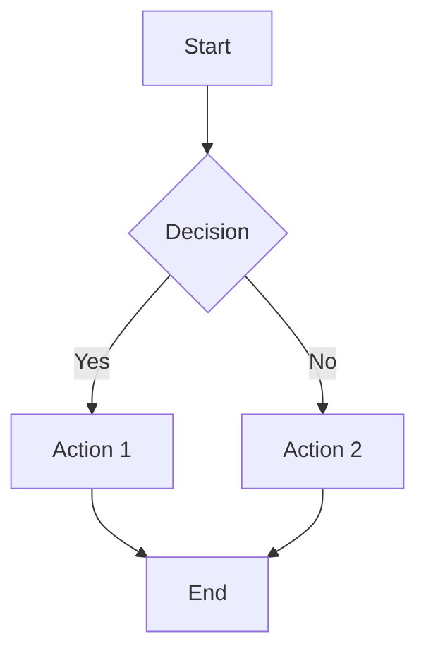
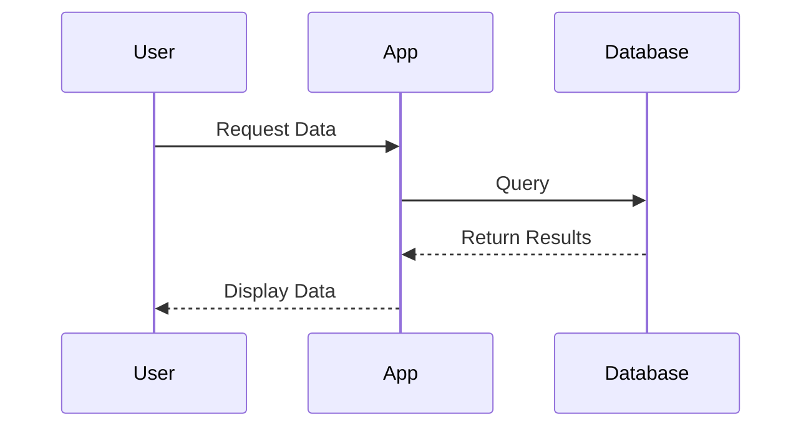
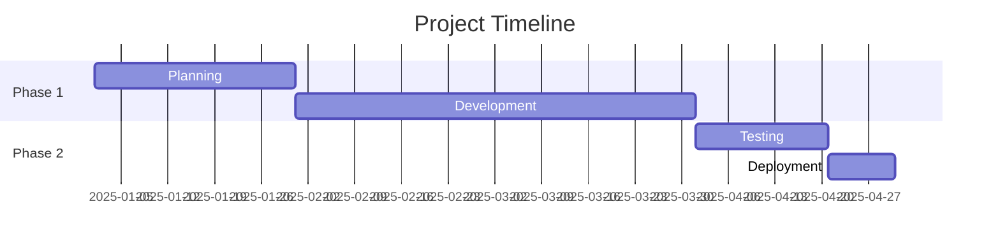
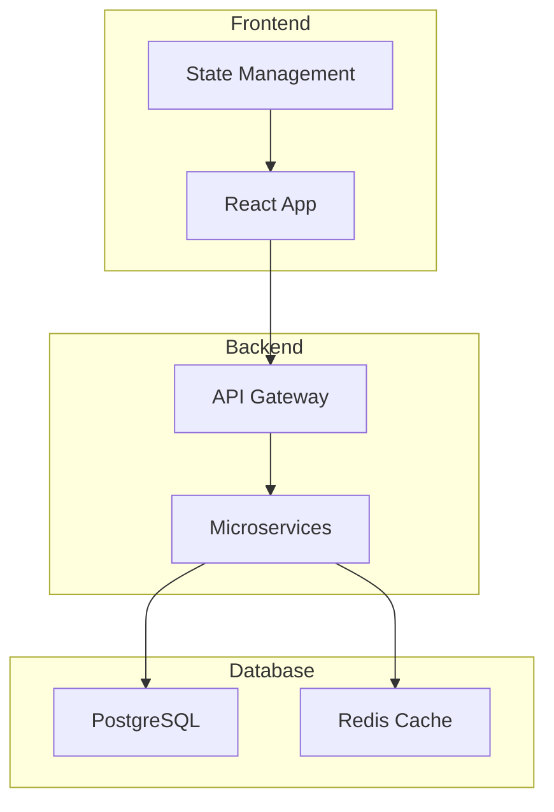

# Layout & Shortcode Testing

This page tests various Eleventy plugins and AMP shortcodes to ensure robust functionality across the site.

## Mermaid Diagrams

### Standard Mermaid (Plugin v2.x)





### Custom Mermaid Shortcode


graph LR
  A[Legacy PHP App] --> B[Docker Container]
  B --> C[Kubernetes Cluster]
  C --> D[Azure GCC High]
  A -->|Helm Charts| E[Deployment]
  E --> C
  C --> F[Load Balancer]
  F --> G[Users]


## AMP Components

### YouTube Embed



### Twitter Embed (Example)



### Instagram Post (Example)



### GitHub Gist (Example)



## Markdown Features

### Typography

This tests **bold text**, *italic text*, ***bold italic***, ~~strikethrough~~, and `inline code`.

### Lists

Unordered list:
- Item one
- Item two
  - Nested item
  - Another nested
- Item three

Ordered list:
1. First step
2. Second step
3. Third step

### Links & Images

[External link](https://example.com)

[Internal link](/content/kubernetes/)

### Blockquotes

> This is a blockquote.
> It can span multiple lines.
>
> And have multiple paragraphs.

### Code Blocks

```javascript
// JavaScript code block
const greeting = "Hello, world!";
console.log(greeting);
```

```python
# Python code block
def hello():
    print("Hello, world!")
```

```bash
# Shell commands
npm install
npm run build
```

## Complex Mermaid Diagrams

### Sequence Diagram





### Gantt Chart





### Flowchart with Subgraphs





## Tables

| Feature | Status | Priority |
|---------|--------|----------|
| Mermaid | ✅ Working | High |
| AMP | ✅ Working | High |
| RSS | ✅ Working | Medium |
| Navigation | ✅ Working | High |

## HTML Elements (AMP-safe)

<details>
<summary>Click to expand</summary>

This is hidden content that can be toggled.

</details>

---

## Testing Notes

- ✅ Mermaid plugin v2.2.1 (CommonJS compatible)
- ✅ AMP plugin with validation disabled
- ✅ Custom mermaidamp shortcode for SVG output
- ✅ RSS feed generation
- ✅ Navigation plugin
- ✅ Markdown-it with HTML enabled

**Last Updated:** November 10, 2025